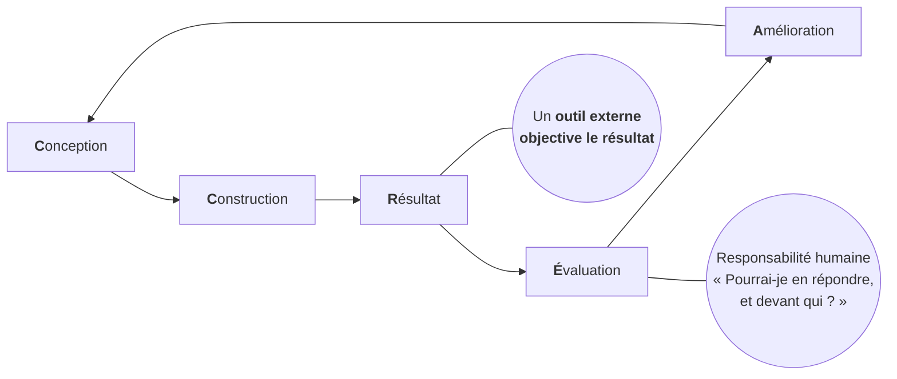

# Foyer — Cadre d'agents pour le logiciel sobre, durable, transmissible

[](https://github.com/gilmry/foyer/actions/workflows/docs.yml)
[](https://gilmry.github.io/foyer/)

[](https://github.com/gilmry/foyer/commits)
[](https://github.com/gilmry/foyer/commits)
[](https://github.com/gilmry/foyer/commits) → <a href="https://codespaces.new/gilmry/foyer" title="Open YOUR CodeSpace Now... CTRL + Click HERE!"></a>

> Production intellectuelle de Gilles Maury, dérivée du Manifeste Maury ([`github.com/gilmry/manifest`](https://github.com/gilmry/manifest), CC BY-SA 4.0).
> Cadre **généralisable à toute organisation** qui arbitre, sous responsabilité humaine (*répondre-de*), ses **choix technologiques hybrides** — cloud / on-premise, propriétaire / open source, avec ou sans support, IA souveraine / API tierce. La même machinerie de décision gouverne chacune de ces surfaces ; l'agent IA n'en est qu'une (voir `skills/arbitrage-hybride.md`).

*Portable : Chaque fichier se charge dans le contexte d'un agent (`AGENTS.md` pour OpenCode/Codex/Aider, `CLAUDE.md` pour Claude Code, ou champ `instructions` d'`opencode.json`).*

## 🚀 Démarrage rapide (Starter `go`)

### 👉 En local (Linux/MacOS/Windows)

Après le '*git clone*' de votre *fork*, dans la ***CLI*** (***C***ommand ***L***ine ***I***nterface = Console) et dans le dossier du projet :

```bash
./go
```

(Installation des dépendances si pas déjà fait, lancement de l'app et activation du Hot Reload)

→ URL locale : [**http://localhost:8000**](http://localhost:8000)

Notes utiles :

- Port et hôte personnalisables via `FOYER_PORT` et `FOYER_HOST` dans les fichiers starter './go'.
- Sous Linux/MacOS ('./go'), si besoin : `chmod +x go`.
- Sous Windows ('./go.ps1'), si les scripts sont bloqués : `Set-ExecutionPolicy -Scope Process Bypass`.
- Hot reload actif: Toute modification dans `README.md`, `Manifeste-Foyer.md`, `Methode-Foyer.md`, `Boucle-de-retroaction.md`, `Simulateur-Synthese.md`, `skills/`, `personas/`, `bmad/`, `tools/` ou `notebooklm/` déclenche une reconstruction automatique du site.

### 👉 Et encore + simple et sans rien installer : Codespace

→ <a href="https://codespaces.new/gilmry/foyer" title="Open YOUR CodeSpace Now... CTRL + Click HERE!"></a>

Opérationnel : *Hot Reload*, et bien-sûr, *commits* & *push* 👍

    Rappel : Avant de lancer avec `./go`, autoriser l'exécution avec `chmod +x go`
             (Uniquement lors de la création car l'OS d'un CodeSpace est Linux)

## 📖 Documentation en ligne

**➡️ [gilmry.github.io/foyer](https://gilmry.github.io/foyer/)** — site MkDocs Material qui rassemble le Manifeste, la méthode, les skills, les personas et la **[galerie de supports pédagogiques](https://gilmry.github.io/foyer/supports.html)** : vidéos, podcasts, infographies et pitchs.

Le site est reconstruit et redéployé automatiquement à chaque push sur `main` (GitHub Actions → Pages). La galerie de supports se régénère seule depuis `notebooklm/` — voir `scripts/gen_supports.py` et `.github/workflows/docs.yml`.

## L'idée en une phrase

Tout travail tourne sur un **même cycle** — Conception → Construction → Résultat → Évaluation → Amélioration — où un **outil externe objective** le résultat, et où l'humain garde la responsabilité (*« pourrai-je en répondre, et devant qui ? »*).



## Les trois axes

- **Qui est l'agent** (valeurs) → `Manifeste-Foyer.md`
- **Quel outil objective** (terrain) → `skills/`
- **Qui tient le cercle, à quel grain** (rôle) → `personas/` et `bmad/personas/`

## Carte

```
Manifeste-Foyer.md          Identité positive de l'agent (+ annexe sagesses↔invariants)
Methode-Foyer.md            Vue d'ensemble opérationnelle
Boucle-de-retroaction.md   LA PRIMITIVE — le cercle dont tout hérite

bmad/                      PHASE 1 · Conception (vision → backlog)
  BMAD-Conception.md         orchestrateur (pipeline TOGAF A-F)
  archetypes.md              conditionnement : stateless/stateful × API-first/full-stack
  personas/                  Analyste → PM → Architecte → Scrum Master → Validateur
  livrables/                 5 templates (Brief, PRD, Architecture, Stories, Validation)

skills/                    Les 4 outils d'objectivation (enfants de la primitive)
  cycle-dev.md               tests pré-écrits (rouge/vert/bleu, 4 tags)
  gates.md                   analyseurs (quality + security) — transversal
  convergence-iac.md         état observé (salt-ssh, GitOps, distroless, rollback)
  adoption.md                usage réel (RACE → Adoption, RICE/WSJF)
  abaque-cout-capacite.md    estimation prospective TCO + ROI + empreinte mémoire
  arbitrage-hybride.md       grille de souveraineté pour tout choix hybride (cloud/on-prem, proprio/OSS, support, IA)
  enforcement.md             les 3 anneaux : permissions / plugin / substrat
  conformite.md              mapping mondial→européen→belge (ISO 42001/27001, AI Act, NIS2/CyFun, CRA) + angles morts
  bootstrap-delivrabilite.md story habilitante aboutie : git clone + agent = tout configuré

tools/gates/               Le COMMENT exécutable, en regard du pourquoi de skills/gates.md
  ADR-outillage.md           LA LISTE CONSOLIDÉE — un outil par gate, verdict de veto
                             ligne par ligne, écartés nommés, + cercle de réexamen
  TOOLS.md                   justification fine par écosystème + annexe agrégateur
  github/ gitlab/            templates CI par stack (8 stacks) — des exemples, pas un livrable
  workstation/               gates de poste (pre-commit) : seuls les secrets bloquent

personas/                  PHASES 2-4 · qui tient le cercle
  chef-de-projet · csi-engineer · support-engineer · estimateur-capacite-cout   (invariants)
  scrum-master · lead-developer · platform-engineer     (conditionnels barreau)
  nexus-integration-team · rte                          (conditionnels échelle)
```

## Le flux de bout en bout

1. **Conception (BMAD)** — cinq personas produisent un backlog validé « Agent IA Ready ». Sortie au verdict PASS uniquement.
2. **Pilotage** — le chef de projet : WBS → Gantt (axe = passes d'agent) → coût (tokens + superviseur vs target) → choix du barreau (Scrum/Nexus/SAFe).
3. **Fabrication** — lead developer + scrum master font tourner `cycle-dev` (+ `gates`) story par story.
4. **Production** — platform engineer tient `convergence-iac` (trigger : AlertManager).
5. **Pilotage continu** — CSI engineer resserre l'estimation (dogfooding) ; support engineer objective l'adoption (`adoption`) et **rouvre une capacité** via RICE.

La **méta-boucle ADR/ADM** (tenue par l'architecte solution = l'agent du Manifeste) est nourrie par toutes ces boucles et cadencée par le barreau déployé.

## Deux coûts, partout

- **Tokens** (génération du modèle, piloté par OpenCode) — 0,85 €/Mtok in, 2,55 €/Mtok out
- **Wall-clock** (latence d'objectivation → temps superviseur) — tailles S=0,5 j / M=0,75 j / L=1 j

## Registre

Tous ces fichiers **orientent** (guidance). Le **blocage déterministe** est l'**enforcement** — formalisé en trois anneaux (`skills/enforcement.md`) : permissions agent, plugin, et **substrat** (hooks git, CI, protection de branche, sandbox) — ce dernier étant le seul dont on répond vraiment. Un beau cadre ne dispense pas de vérifier : *« assez fiable pour qu'on cesse de vérifier »* est le danger surveillé.
